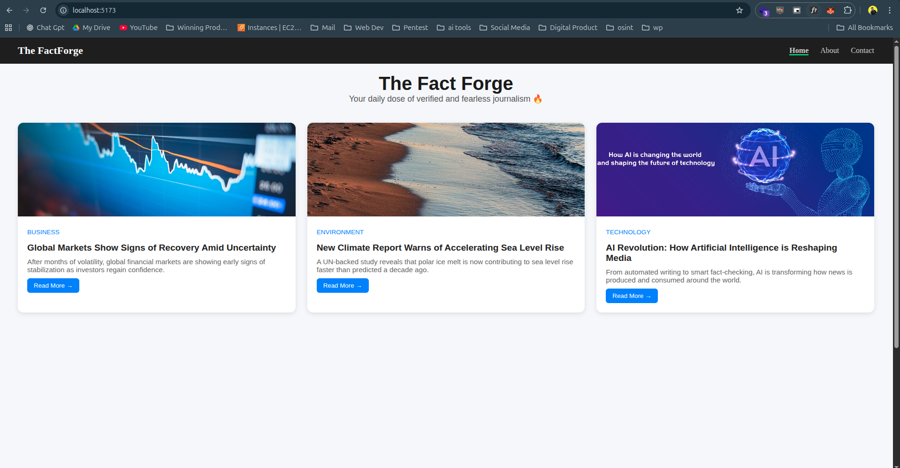
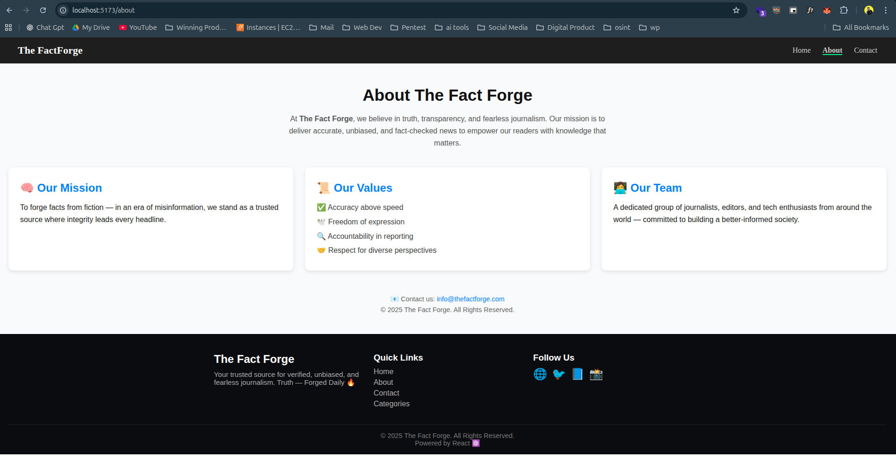

# 🧭 React Router Practice – The Route Forge

A simple React project built to **practice routing using `react-router-dom`**.  
This project includes multiple pages like **Home**, **About**, **Contact**, and **User (Dynamic Route)** to understand React Router step by step.

---

## 🚀 Live Demo
*(Add link here after deploying on Netlify/Vercel)*  
👉 [Live Demo](#)

---

## 🧩 Features
✅ Client-side routing using **React Router DOM**  
✅ Navigation using **NavLink**  
✅ Dynamic URL handling with **useParams**  
✅ Shared layout with **Navbar** and **Footer**  
✅ Page components: Home, About, Contact, and User  
✅ Simple, beginner-friendly structure  

---

